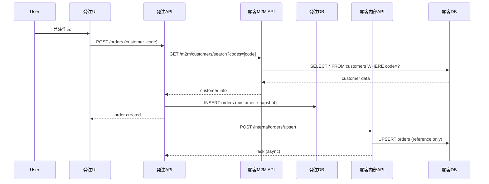
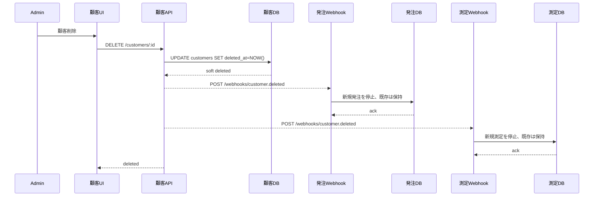
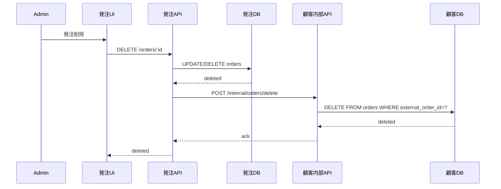

# 08. クロスサービスデータ連携戦略

## 目的

発注システムと測定システムという外部マイクロサービスと、顧客管理システム（本サービス）の間で、顧客情報を軸にしたデータ参照・検索・ソートをスムーズに行うための戦略を定義する。特に、データ削除時の整合性維持とコンフリクト回避を実現する。

## 前提条件と原則

### サービス境界
- **顧客管理サービス（本サービス）**: 顧客データのOwning Service。顧客情報の唯一の書き込み主体
- **発注サービス（外部）**: 発注データのOwning Service。発注情報の書き込み主体
- **測定サービス（外部）**: 測定データのOwning Service。測定情報の書き込み主体

### ゼロトラスト原則
- 各サービスは独立したデータストアを持つ
- 直接のDB間アクセスは禁止
- すべてのデータアクセスはAPI経由
- 各サービスが自サービスのデータ整合性に責任を持つ

### リアルタイム要件
- キャッシュは原則禁止（障害時の限定的フォールバックのみ）
- Source → DB → UI: P99 ≤ 3秒
- Webhook-first、差分Pullは補完のみ

## データ連携アーキテクチャ

### 1. 参照データの持ち方

#### 顧客管理サービス（本サービス）が保持するデータ
```
customers テーブル:
  - id (UUID, 本サービスの主キー)
  - code (顧客コード、外部連携用の安定ID)
  - name, contact, address など

orders テーブル（参照情報のみ）:
  - id (UUID, 本サービスでの内部ID)
  - customer_id (UUID, customers.id への参照)
  - external_order_id (TEXT, 発注サービスの注文ID)
  - source_system (TEXT, 'OrderingService')
  - title, status など（最小限の要約情報）
  - ordered_at, created_at

measurements テーブル（参照情報のみ）:
  - id (UUID, 本サービスでの内部ID)
  - customer_id (UUID, customers.id への参照)
  - order_id (UUID, 本サービスのorders.id、nullable)
  - external_measurement_id (TEXT, 測定サービスの測定ID)
  - source_system (TEXT, 'MeasurementService')
  - summary (JSONB, 最小限の要約情報)
  - measured_at, created_at
```

#### 発注サービスが保持するデータ
```
orders テーブル:
  - id (UUID, 発注サービスの主キー = external_order_id)
  - customer_reference (TEXT, 顧客管理サービスの customers.code)
  - customer_snapshot (JSONB, 発注時点の顧客情報のスナップショット)
  - items, pricing, shipping など（発注の詳細データ）
  - status, created_at, updated_at
```

#### 測定サービスが保持するデータ
```
measurements テーブル:
  - id (UUID, 測定サービスの主キー = external_measurement_id)
  - customer_reference (TEXT, 顧客管理サービスの customers.code)
  - order_reference (TEXT, 発注サービスの order_id、nullable)
  - customer_snapshot (JSONB, 測定時点の顧客情報のスナップショット)
  - measurement_data (JSONB, 測定の詳細データ)
  - measured_at, created_at, updated_at
```

### 2. データ連携のキー設計

#### 顧客コード (customers.code) を連携キーとする理由

**採用**: `customers.code` を外部連携の安定した識別子として使用

**理由**:
- UUIDは内部的で人間に読みづらい
- 顧客コードはビジネス上の意味がある（例: CUST-20251022-0001）
- 自動採番により一意性が保証される
- 変更されない（immutable）
- 他システムとの連携時に参照しやすい

**代替案の不採用理由**:
- ❌ UUID（customers.id）: 人間に優しくない、ログ追跡が困難
- ❌ 名前: 変更可能性、重複リスク
- ❌ 複合キー: 複雑性増加、変更リスク

#### 連携キーの命名規則
- 顧客管理 → 外部: `customer_reference` (TEXT, customers.code を格納)
- 発注 → 顧客管理: `external_order_id` (TEXT, 発注サービスの order.id を格納)
- 測定 → 顧客管理: `external_measurement_id` (TEXT, 測定サービスの measurement.id を格納)

### 3. スナップショット戦略（Eventual Consistency対応）

#### スナップショットが必要な理由
顧客情報は変更される可能性があるが、発注・測定時点の情報を保持する必要がある。

#### 実装方針
```json
// 発注サービスのorders.customer_snapshotの例
{
  "customer_code": "CUST-20251022-0001",
  "name": "山田太郎",
  "contact": "090-1234-5678",
  "address": {
    "postal_code": "100-0001",
    "prefecture": "東京都",
    "city": "千代田区千代田",
    "address_line1": "1-1",
    "address_line2": "皇居"
  },
  "snapshot_at": "2025-10-22T10:30:00Z"
}
```

**スナップショット取得タイミング**:
- 発注作成時: 顧客管理サービスのM2M APIから最新情報を取得してスナップショット
- 測定作成時: 同様にM2M APIから取得

**スナップショットの用途**:
- 帳票出力（発注書、測定レポート）での過去時点情報の再現
- 変更履歴の追跡
- データ分析時の整合性確保

## データ削除戦略（核心）

### 削除の種類と影響範囲

#### Case 1: 顧客削除（顧客管理サービス）

**方針**: ソフトデリート + 外部サービスへの通知

```sql
-- 顧客のソフトデリート
UPDATE customers
SET deleted_at = NOW()
WHERE id = :customer_id;

-- 関連するorders/measurementsは削除しない（履歴として保持）
-- 外部サービスには削除通知のみ送信
```

**実装詳細**:

1. **顧客管理サービス側**:
   - `customers.deleted_at` を設定（ソフトデリート）
   - RLSポリシーで `deleted_at IS NULL` の条件を追加し、削除済みは非表示
   - 削除通知を外部サービスに送信（Webhook）

2. **外部サービス側の対応**:
   - Webhookを受信: `POST /webhooks/customer.deleted`
   ```json
   {
     "event": "customer.deleted",
     "customer_code": "CUST-20251022-0001",
     "deleted_at": "2025-10-22T15:00:00Z"
   }
   ```
   - 受信後の処理:
     - 該当顧客の新規発注/測定を停止（UIで非表示化）
     - 既存のorders/measurementsは保持（履歴として）
     - `customer_reference`は保持し、UIで「削除済み顧客」として表示

3. **復元対応**:
   ```sql
   -- 顧客の復元
   UPDATE customers
   SET deleted_at = NULL
   WHERE id = :customer_id;

   -- 復元通知をWebhookで送信
   ```

**メリット**:
- 履歴データの保全
- 監査要件への対応
- 誤削除からの復旧が容易

#### Case 2: 発注削除（発注サービス）

**方針**: 顧客管理サービスの参照レコードも削除

```javascript
// 発注サービス側
async function deleteOrder(orderId) {
  // 1. 発注サービスで削除（またはソフトデリート）
  await db.orders.update({
    where: { id: orderId },
    data: { deleted_at: new Date() }
  })

  // 2. 顧客管理サービスに削除通知
  await customerManagementAPI.post('/internal/orders/delete', {
    external_order_id: orderId,
    source_system: 'OrderingService'
  })
}
```

```javascript
// 顧客管理サービス側の内部API
POST /internal/orders/delete
{
  "external_order_id": "order-uuid-123",
  "source_system": "OrderingService"
}

// 処理:
DELETE FROM orders
WHERE external_order_id = :external_order_id
  AND source_system = :source_system;
```

**特記事項**:
- 顧客管理サービス側は参照データのみなので物理削除でOK
- 発注サービス側は監査要件に応じてソフトデリートを検討

#### Case 3: 測定削除（測定サービス）

発注削除と同様の方針。

```javascript
POST /internal/measurements/delete
{
  "external_measurement_id": "measurement-uuid-456",
  "source_system": "MeasurementService"
}
```

### 削除時の整合性保証

#### トランザクション境界
- 各サービスは自サービス内でトランザクションを完結
- サービス間は最終的整合性（Eventual Consistency）

#### 冪等性保証
```javascript
// 削除APIは冪等に実装
app.post('/internal/orders/delete', async (req, res) => {
  const { external_order_id, source_system } = req.body

  // すでに削除されている場合も成功を返す（冪等性）
  const result = await db.orders.deleteMany({
    where: {
      external_order_id,
      source_system
    }
  })

  return res.json({
    success: true,
    deleted: result.count
  })
})
```

#### リトライとエラーハンドリング
```javascript
// 発注サービス側: エクスポネンシャルバックオフでリトライ
async function notifyCustomerServiceOfDeletion(orderId, maxRetries = 3) {
  for (let attempt = 0; attempt < maxRetries; attempt++) {
    try {
      await customerManagementAPI.post('/internal/orders/delete', {
        external_order_id: orderId,
        source_system: 'OrderingService',
        idempotency_key: `delete-${orderId}-${Date.now()}`
      })
      return { success: true }
    } catch (error) {
      if (attempt === maxRetries - 1) {
        // 最終リトライ失敗: integration_jobsに記録し、手動対応へ
        await logFailedIntegration({
          job_type: 'delete_order_reference',
          payload: { external_order_id: orderId },
          error: error.message
        })
        throw error
      }
      // エクスポネンシャルバックオフ
      await sleep(Math.pow(2, attempt) * 1000)
    }
  }
}
```

## 検索・ソート戦略

### ユースケース別の実装方針

#### UC1: 顧客管理サービスで「顧客+発注+測定」を統合表示

**実装**: 本サービス内のデータで完結

```sql
-- 顧客一覧と発注件数、測定件数
SELECT
  c.id,
  c.code,
  c.name,
  c.contact,
  COUNT(DISTINCT o.id) as order_count,
  COUNT(DISTINCT m.id) as measurement_count,
  MAX(o.ordered_at) as last_order_date,
  MAX(m.measured_at) as last_measurement_date
FROM customers c
LEFT JOIN orders o ON c.id = o.customer_id
LEFT JOIN measurements m ON c.id = m.customer_id
WHERE c.deleted_at IS NULL
GROUP BY c.id
ORDER BY last_order_date DESC NULLS LAST;
```

**ポイント**:
- 本サービスの参照データ（orders/measurements）で集計可能
- リアルタイム性が高い（Webhook経由で常に最新）
- 詳細データは外部サービスへのリンクで参照

#### UC2: 発注サービスで「顧客情報付き発注一覧」を表示

**実装パターンA**: スナップショットを活用（推奨）

```javascript
// 発注サービス内で完結
const orders = await db.orders.findMany({
  select: {
    id: true,
    customer_reference: true,
    customer_snapshot: true, // スナップショットから表示
    status: true,
    created_at: true
  },
  orderBy: { created_at: 'desc' }
})

// フロントエンドで表示
orders.map(order => ({
  orderId: order.id,
  customerName: order.customer_snapshot.name,
  customerContact: order.customer_snapshot.contact,
  status: order.status,
  orderedAt: order.created_at
}))
```

**メリット**:
- 他サービスへのAPIコール不要
- レスポンス高速
- 顧客サービス障害時も表示可能

**デメリット**:
- 最新の顧客情報ではない（注文時点のスナップショット）

**実装パターンB**: リアルタイム参照（補助的）

```javascript
// 最新情報が必要な場合のみ
async function enrichOrdersWithLatestCustomerInfo(orders) {
  const customerCodes = [...new Set(orders.map(o => o.customer_reference))]

  // 顧客管理サービスのM2M APIで一括取得
  const customers = await customerManagementAPI.post('/m2m/customers/bulk', {
    codes: customerCodes
  })

  const customerMap = new Map(customers.map(c => [c.code, c]))

  return orders.map(order => ({
    ...order,
    customer_latest: customerMap.get(order.customer_reference),
    customer_snapshot: order.customer_snapshot
  }))
}
```

**使い分け**:
- 一覧表示: スナップショット（高速）
- 詳細表示: リアルタイム参照（正確性優先）

#### UC3: 顧客名で発注を検索（発注サービス内）

**実装**: JSONB検索とGINインデックス

```sql
-- 発注サービス側のテーブル定義
CREATE TABLE orders (
  id UUID PRIMARY KEY,
  customer_reference TEXT NOT NULL,
  customer_snapshot JSONB NOT NULL,
  -- ... other fields
  created_at TIMESTAMPTZ DEFAULT NOW()
);

-- JSONB検索用のGINインデックス
CREATE INDEX idx_orders_customer_snapshot_gin
ON orders USING GIN (customer_snapshot);

-- 顧客名で検索
SELECT * FROM orders
WHERE customer_snapshot->>'name' ILIKE '%山田%'
ORDER BY created_at DESC;

-- 複合条件
SELECT * FROM orders
WHERE customer_snapshot->>'name' ILIKE '%山田%'
  AND status = 'completed'
ORDER BY created_at DESC;
```

#### UC4: 発注件数でソート（顧客管理サービス）

すでにUC1で実装済み。本サービスのordersテーブルで集計可能。

### M2M API設計（顧客参照API）

```typescript
// GET /m2m/customers/search
interface CustomerSearchRequest {
  q?: string              // 検索クエリ（名前、コード、連絡先）
  codes?: string[]        // 顧客コードの配列（一括取得用）
  limit?: number          // 最大件数（デフォルト: 20, 最大: 100）
  offset?: number         // オフセット
  include_deleted?: boolean // 削除済みも含める（デフォルト: false）
}

interface CustomerSearchResponse {
  data: Array<{
    id: string
    code: string
    name: string
    name_kana: string | null
    type: string
    contact: string
    postal_code: string | null
    prefecture: string | null
    city: string | null
    address_line1: string | null
    address_line2: string | null
    created_at: string
    updated_at: string
    deleted_at: string | null
  }>
  total: number
  limit: number
  offset: number
}

// POST /m2m/customers/bulk（一括取得最適化版）
interface BulkCustomerRequest {
  codes: string[]  // 最大100件
}

interface BulkCustomerResponse {
  data: Array<CustomerData>
  not_found: string[] // 見つからなかった顧客コード
}
```

**認証**: OAuth2 Client Credentials
**レート制限**: 100 req/min per client
**SLO**: P95 < 200ms

## データ同期フロー

### フロー1: 発注作成時の顧客情報取得



### フロー2: 顧客削除時の整合性維持



### フロー3: 発注削除時の参照クリーンアップ



## エラーハンドリングと監視

### 整合性チェックジョブ

定期的に整合性をチェックし、ズレを検出・修正する。

```javascript
// 顧客管理サービス側: 孤立参照の検出
async function detectOrphanedReferences() {
  // 発注サービスに存在しない external_order_id を検出
  const orphanedOrders = await db.$queryRaw`
    SELECT o.id, o.external_order_id, o.source_system
    FROM orders o
    WHERE NOT EXISTS (
      -- 発注サービスAPIで確認（バッチ処理）
      -- 実装: 外部APIに問い合わせて存在確認
    )
  `

  // 孤立参照を削除または管理者に通知
  for (const order of orphanedOrders) {
    await logIntegrityIssue({
      type: 'orphaned_order_reference',
      data: order,
      recommended_action: 'delete'
    })
  }
}

// 発注サービス側: 存在しない顧客コードの検出
async function detectInvalidCustomerReferences() {
  const uniqueCustomerCodes = await db.$queryRaw`
    SELECT DISTINCT customer_reference
    FROM orders
  `

  // 顧客管理サービスに一括問い合わせ
  const validCodes = await customerManagementAPI.post('/m2m/customers/bulk', {
    codes: uniqueCustomerCodes.map(r => r.customer_reference)
  })

  const validCodeSet = new Set(validCodes.data.map(c => c.code))
  const invalidReferences = uniqueCustomerCodes.filter(
    r => !validCodeSet.has(r.customer_reference)
  )

  // 無効な参照を検出し通知
  for (const ref of invalidReferences) {
    await logIntegrityIssue({
      type: 'invalid_customer_reference',
      customer_reference: ref.customer_reference,
      recommended_action: 'review_and_fix'
    })
  }
}
```

**実行頻度**:
- 整合性チェック: 毎日1回（深夜バッチ）
- 重大な不整合: 即座にアラート

### 監視メトリクス

```yaml
# 顧客管理サービス
metrics:
  - name: orphaned_references_count
    description: 孤立した外部参照の件数
    alert_threshold: > 0

  - name: m2m_api_latency_p95
    description: M2M API P95レイテンシ
    alert_threshold: > 200ms

  - name: webhook_delivery_failure_rate
    description: Webhook配信失敗率
    alert_threshold: > 5%

# 発注サービス
metrics:
  - name: invalid_customer_references_count
    description: 無効な顧客参照の件数
    alert_threshold: > 0

  - name: customer_snapshot_staleness_days
    description: スナップショットの最大経過日数
    warning_threshold: > 365
```

## 実装チェックリスト

### 顧客管理サービス
- [ ] customers.code の自動採番実装（既存）
- [ ] customers.deleted_at によるソフトデリート
- [ ] RLSポリシーに deleted_at IS NULL 条件追加
- [ ] M2M API実装（/m2m/customers/search, /m2m/customers/bulk）
- [ ] 内部API実装（/internal/orders/upsert, /internal/orders/delete）
- [ ] Webhook送信実装（customer.deleted, customer.updated）
- [ ] 整合性チェックジョブ実装

### 発注サービス
- [ ] customer_reference (TEXT) カラム追加
- [ ] customer_snapshot (JSONB) カラム追加
- [ ] customer_snapshot のGINインデックス作成
- [ ] 発注作成時に顧客M2M APIから情報取得
- [ ] Webhook受信実装（/webhooks/customer.deleted, /webhooks/customer.updated）
- [ ] 発注削除時の顧客管理サービスへの通知実装
- [ ] 整合性チェックジョブ実装

### 測定サービス
- [ ] customer_reference (TEXT) カラム追加
- [ ] order_reference (TEXT) カラム追加（optional）
- [ ] customer_snapshot (JSONB) カラム追加
- [ ] customer_snapshot のGINインデックス作成
- [ ] 測定作成時に顧客M2M APIから情報取得
- [ ] Webhook受信実装（/webhooks/customer.deleted, /webhooks/customer.updated）
- [ ] 測定削除時の顧客管理サービスへの通知実装
- [ ] 整合性チェックジョブ実装

## FAQ

### Q1: 顧客情報が更新されたら、既存の発注・測定のスナップショットも更新すべきか？

**A**: 基本的には更新しない。スナップショットは「その時点の情報」を保持することに意義がある。

ただし、以下のケースでは更新を検討：
- 顧客から明示的な修正依頼があった場合（住所の誤記など）
- 法令要件で最新情報への更新が必要な場合

更新する場合は監査ログに記録し、変更履歴を保持する。

### Q2: 発注サービスが長時間ダウンした場合、顧客管理サービスのordersテーブルの整合性は？

**A**: 以下の復旧手順：

1. 発注サービス復旧後、差分Pull APIで未同期データを取得
2. 顧客管理サービスの内部API（/internal/orders/upsert）に一括送信
3. integration_jobsテーブルで同期状態を追跡

```javascript
// 発注サービス復旧時の差分同期
async function syncOrdersToCustomerService(since) {
  const orders = await db.orders.findMany({
    where: {
      updated_at: { gte: since }
    }
  })

  for (const order of orders) {
    await customerManagementAPI.post('/internal/orders/upsert', {
      customer_code: order.customer_reference,
      external_order_id: order.id,
      source_system: 'OrderingService',
      title: order.title,
      status: order.status,
      ordered_at: order.created_at
    }, {
      headers: {
        'Idempotency-Key': `sync-${order.id}-${order.updated_at}`
      }
    })
  }
}
```

### Q3: 顧客コードが衝突したらどうするか？

**A**: 顧客コードは自動採番により一意性が保証される（CUST-YYYYMMDD-NNNN形式）。衝突は発生しない設計。

万が一の対策:
- データベースのUNIQUE制約
- 採番時のロック機構
- 衝突検出時の再試行ロジック

### Q4: M2M APIのレート制限を超えた場合の対応は？

**A**:
1. **設計時**: バッチ取得API（/m2m/customers/bulk）を優先的に使用し、APIコール数を削減
2. **実行時**: 429エラー時はRetry-Afterヘッダーに従って待機
3. **恒久対策**: レート制限の引き上げをインフラチームに依頼

```javascript
async function fetchCustomersWithRateLimitHandling(codes) {
  const maxRetries = 3
  for (let i = 0; i < maxRetries; i++) {
    try {
      return await customerManagementAPI.post('/m2m/customers/bulk', { codes })
    } catch (error) {
      if (error.response?.status === 429) {
        const retryAfter = error.response.headers['retry-after'] || Math.pow(2, i)
        await sleep(retryAfter * 1000)
        continue
      }
      throw error
    }
  }
  throw new Error('Rate limit exceeded after retries')
}
```

## まとめ

本戦略により、以下を実現：

1. **データ整合性の維持**: スナップショット + 参照IDの組み合わせで、削除・更新時の整合性を保証
2. **パフォーマンス**: スナップショットによる他サービスへの依存削減、M2M APIの最適化
3. **リアルタイム性**: Webhook-firstアプローチによる低遅延同期
4. **回復性**: 冪等性保証、リトライ機構、整合性チェックジョブによる自動修復
5. **監査可能性**: すべての同期操作をログ記録、整合性問題の検出と通知

各サービスが独立性を保ちながら、必要な情報を効率的に参照できる設計となっている。
